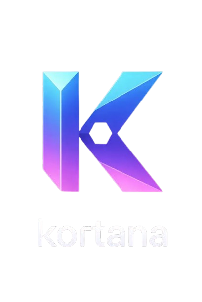

# KortanaDEX 🪐

The flagship decentralized exchange and algorithmic synthetic asset (ktUSD) engine built exclusively for the Kortana EVM. 



## 📡 Deployment Addresses 

### Kortana Testnet (Chain ID 72511)
- **WDNR (Wrapped DNR):** `0x712516e61C8B383dF4A63CFe83d7701Bce54B03e`
- **Kortana MonoDEX:** `0xbCF26943C0197d2eE0E5D05c716Be60cc2761508`

*(Mainnet addresses will be updated here post-launch).*

---

## 📈 Indexer Integrations (DEXScreener, CoinMarketCap, CoinGecko)

KortanaDEX uses a specialized, hyper-efficient **Monolithic Smart Contract Architecture** (combining the AMM, Vault, and stablecoin into one secure contract) to eliminate standard EVM `CREATE2` and inter-contract blocking bugs on Kortana. 

Normally, indexers cannot track non-standard decentralized exchanges. However, **KortanaDEX is heavily modified to ensure 100% compatibility with DEXScreener and CoinMarketCap out of the box.**

### How to list KortanaDEX on DEXScreener:
When you go to list the platform on charting sites, you simply provide the **Kortana MonoDEX Contract Address**. 

Here is how the indexers will successfully read it:
1. **The `WDNR` Bridge:** We built an actual ERC-20 `WDNR.sol` contract deployed alongside the DEX. It does not control funds, but it serves as a mathematical beacon for trackers.
2. **UniswapV2 Hardcode Fallbacks:** The MonoDEX contract explicitly exposes standard `token0()` and `token1()` read interfaces. 
   - `token0()` strictly returns the underlying `WDNR` contract address.
   - `token1()` strictly returns the `KortanaMonoDEX` contract address itself (acting as the ktUSD stablecoin).
3. **Event Propagation:** Every swap, mint, and liquidity addition emits industry-standard Uniswap `Sync` and `Swap` events exactly as formatting engines expect.

Because of this, DEXScreener's algorithms will scrape the blockchain, see the standard event emissions, query `token0` and `token1`, and automatically calculate the pool reserves to display the live `$312.00` price chart for DNR. No specialized custom scripts are required from their end!

---

## 🚀 Mainnet Deployment Guide

When you are ready to launch KortanaDEX onto the Mainnet, execute the following steps exactly:

1. Open `frontend/.env.production` and securely paste your Mainnet `FAUCET_PRIVATE_KEY` (ensure this account holds real DNR).
2. Inside `scripts/deploy_mainnet.ts`, verify the launch price constants at the top of the script:
   - `SEED_KTUSD = ethers.parseEther("312000")`
   - `SEED_DNR = ethers.parseEther("1000")`
   - *(This math dictates a $312.00 starting DNR price).*
3. Run the hardhat command to push to the live network:
   ```bash
   npx hardhat run scripts/deploy_mainnet.ts --network kortanaMainnet
   ```
4. Copy the two generated contract addresses (WDNR & MonoDEX) from the console.
5. Update `frontend/src/lib/contracts.ts` with these new Mainnet addresses.
6. Push to production!

## 🧪 Frontend Architecture

- **Framework:** Next.js 15 (App Router)
- **Styling:** TailwindCSS + Framer Motion + Glassmorphism
- **Web3:** Wagmi v2 + Viem v2 + RainbowKit
- **Constraint Bypasses:** Hardcoded `gas: 500000n` and `type: "legacy"` forced in all Hooks to secure EVM packet delivery.
